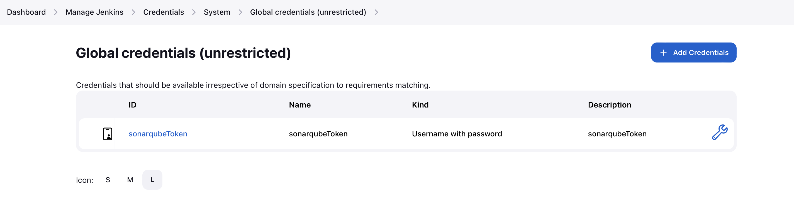

# Assignment 2: Ansible&CD

|   |                                   |
|---------------|-----------------------------------|
| Student Name  | Hemant Hari Kumar                 |
| Andrew ID     | hharikum                          |
| Course Name   | DevOps and Continuous Integration |
| Course Code   | 17646                             |
| Instructor    | Hasan Yasar                       |

## Environment Details
### Host Environment
|             |                               |
|-------------------------------|-------------------------------|
| Operating System              | macOS Ventura                 |
| OS Version                    | 13.0                          |
| Host Machine (Bare Metal Machine) | Macbook Air M2 2022 (13-inch) |
| Processor                     | Apple M2                      |
| Host Chipset Instruction Set  | ARM64                         |
| RAM                           | 16 GB                         |
| Storage                       | 251 GB SSD (Single Partition) |

### Docker Details
|                                   |                               |
|-----------------------------------|-------------------------------|
| Containerization Platform         | Docker                        |
| Version                           | Docker version 20.10.21, build baeda1f                          |

### Docker Compose Details
|                      |                                |
|----------------------|--------------------------------|
| Docker Orchestration | Docker Compose                 |
| Version              | Docker Compose version v2.13.0 |

### Python Details
|                      |                                |
|----------------------|--------------------------------|
| Python | v3.9.13                |
| Pip             | v22.0.4 |

### Docker Container Details
|         Container             |                Software Version                |                Docker Image                |
|----------------------|--------------------------------|--------------------------------|
| Jenkins Server | v2.400                | jenkins/jenkins:2.235.1|
| SonarQube Server            | v10.0.0.68432| arm64v8/sonarqube:10.0.0|
| Postgres           | v13.0 | postgres:13 |
| Maven           | v13.0 | postgres:13 |

### Ansible Details
|         Container             |                Software Version                |
|----------------------|--------------------------------|
ansible            | 7.4.0
ansible-core       | 2.14.4


## Pre-Requisites
### 1. Install Docker and Docker Compose
1. Install <code>Docker Desktop</code> by visiting the following URL<br>
   [Docker Desktop](https://docs.docker.com/desktop/install/mac-install/)
   Click on "Docker Desktop for Mac with Apple Silicon"
    
   
2. Open the downloaded <code>.dmg</code> file, and drag the Docker application to the application folder as shown below.
   
3. After this, docker will configure itself and the Docker Desktop window will open up as shown below. Make sure that the green bar at the bottom left is glowing, which indicates that the Docker Desktop and the Docker daemon are running.

4. Let's check the installed docker version. Open up the terminal on your Mac and run the following command.<br>
<code>docker -v</code><br>
You should see an output similar to the one shown below.
```
(venv) (base) Hemants-MacBook-Air:Assignment-1 hemanthkumar$ docker -v
Docker version 20.10.21, build baeda1f
```
5. The docker compose plugin should also have been installed along with Docker Desktop. Check with the following command: <br>
<code>docker compose version</code><br>
You should see an output similar to the one shown below.
```
(venv) (base) Hemants-MacBook-Air:Assignment-1 hemanthkumar$ docker compose version
Docker Compose version v2.13.0
```

### 2. Install Python (to run the automated scripts)
1. Visit the following URL: [Python Download](https://www.python.org/downloads/macos/) and select the version <code>3.9.13</code> Universal Installer.

2. A <code>.pkg</code> file will be downloaded. Open the file and go through the steps you will see in the popup dialog box.
3. After completing the steps, you should have Python installed in your Mac. Verify by running this command in your terminal<br>
<code>python3 --version</code><br>
```
(venv) (base) Hemants-MacBook-Air:Assignment-1 hemanthkumar$ python3 --version
Python 3.9.13
```
4. pip should also be installed in your system. Check using the following command<br>
<code>pip --version</code><br>
```
(venv) (base) Hemants-MacBook-Air:Assignment-1 hemanthkumar$ pip --version
pip 22.0.4 from /Users/hemanthkumar/2023/Mini 4/DevOps/Assignment-1/venv/lib/python3.9/site-packages/pip (python 3.9)
```
5. Create a file called <code>requirements.txt</code> in your project's root folder. Paste the following content into it.
```
certifi==2022.12.7
charset-normalizer==3.1.0
idna==3.4
jenkinsapi==0.3.13
multi-key-dict==2.0.3
pbr==5.11.1
python-dotenv==1.0.0
python-sonarqube-api==1.3.6
pytz==2023.3
requests==2.28.2
six==1.16.0
urllib3==1.26.15
```
6. Install these required packages by running the following command while termninal session is pointing to the project's root folder.<br>
<code>pip install -r requirements.txt</code><br>
You might see an output similar to the one below.
```
(venv) (base) Hemants-MacBook-Air:Assignment-1 hemanthkumar$ pip install -r requirements.txt
Requirement already satisfied: certifi==2022.12.7 in ./venv/lib/python3.9/site-packages (from -r requirements.txt (line 1)) (2022.12.7)
Requirement already satisfied: charset-normalizer==3.1.0 in ./venv/lib/python3.9/site-packages (from -r requirements.txt (line 2)) (3.1.0)
Requirement already satisfied: idna==3.4 in ./venv/lib/python3.9/site-packages (from -r requirements.txt (line 3)) (3.4)
Requirement already satisfied: jenkinsapi==0.3.13 in ./venv/lib/python3.9/site-packages (from -r requirements.txt (line 4)) (0.3.13)
Requirement already satisfied: multi-key-dict==2.0.3 in ./venv/lib/python3.9/site-packages (from -r requirements.txt (line 5)) (2.0.3)
Requirement already satisfied: pbr==5.11.1 in ./venv/lib/python3.9/site-packages (from -r requirements.txt (line 6)) (5.11.1)
Requirement already satisfied: python-dotenv==1.0.0 in ./venv/lib/python3.9/site-packages (from -r requirements.txt (line 7)) (1.0.0)
Requirement already satisfied: python-sonarqube-api==1.3.6 in ./venv/lib/python3.9/site-packages (from -r requirements.txt (line 8)) (1.3.6)
Requirement already satisfied: pytz==2023.3 in ./venv/lib/python3.9/site-packages (from -r requirements.txt (line 9)) (2023.3)
Requirement already satisfied: requests==2.28.2 in ./venv/lib/python3.9/site-packages (from -r requirements.txt (line 10)) (2.28.2)
Requirement already satisfied: six==1.16.0 in ./venv/lib/python3.9/site-packages (from -r requirements.txt (line 11)) (1.16.0)
Requirement already satisfied: urllib3==1.26.15 in ./venv/lib/python3.9/site-packages (from -r requirements.txt (line 12)) (1.26.15)
WARNING: You are using pip version 22.0.4; however, version 23.0.1 is available.
You should consider upgrading via the '/Users/hemanthkumar/2023/Mini 4/DevOps/Assignment-1/venv/bin/python3 -m pip install --upgrade pip' command.
```

## Build the docker containers
There are 4 containers we will be building, namely <code>jenkins</code>, <code>sonarqube</code>, <code>webserver</code> and <code>postgres</code>. 
* The <code>jenkins</code> container is the latest version of Jenkins at the time of writing (12 Apr 2023) - <code>jenkins/jenkins:2.235.1</code>. It contains a jenkins server, and we will be extending the image for our usage.
* The <code>sonarqube</code> container is the latest version of SonarQube at the time of writing (12 Apr 2023) - <code>arm64v8/sonarqube:10.0.0</code>. We will be using the ARM version of the image as we are running on Apple Silicon. We are using this image as is, with only configuration changes.
* The <code>postgres</code> is <code>postgres:13</code> image. It is used directly without any changes or extensions. The sonarqube container requires connection with postgres to store the details of jobs, user settings, etc.
* The <code>webserver</code> is <code>maven:latest</code> image. It is modified to be forever running as it is our webserver for the purposes of this assignment.

## Extending and Building <code>jenkins</code> container
1. In your project root folder, create a folder called <code>Jenkins</code> and create a file named <code>Dockerfile</code> within it.
2. In the created <code>Dockerfile</code>, paste the following content.
```
FROM jenkins/jenkins:latest
ENV JAVA_OPTS -Djenkins.install.runSetupWizard=false

USER root
RUN apt-get update \
    && apt-get install \
           ca-certificates \
           curl \
           gnupg
RUN mkdir -m 0755 -p /etc/apt/keyrings
RUN curl -fsSL https://download.docker.com/linux/debian/gpg | gpg --dearmor -o /etc/apt/keyrings/docker.gpg
RUN echo \
      "deb [arch="$(dpkg --print-architecture)" signed-by=/etc/apt/keyrings/docker.gpg] https://download.docker.com/linux/debian \
      "$(. /etc/os-release && echo "$VERSION_CODENAME")" stable" | \
      tee /etc/apt/sources.list.d/docker.list > /dev/null
RUN apt-get update
RUN apt-get install -y docker-ce docker-ce-cli containerd.io docker-buildx-plugin docker-compose-plugin python3-pip
RUN pip install docker ansible

#automatically installing all plugins
COPY plugins.txt /usr/share/jenkins/ref/plugins.txt
RUN jenkins-plugin-cli -f /usr/share/jenkins/ref/plugins.txt
```
3. We want a few plugins to be installed in the jenkins server so that we can run the pipeline later. So, create a <code>plugins.txt</code> file in the same folder, and paste the following content in it.
```
javax-activation-api
javax-mail-api
cloudbees-folder
mina-sshd-api-common
mina-sshd-api-core
sshd
antisamy-markup-formatter
structs
token-macro
build-timeout
credentials
trilead-api
ssh-credentials
workflow-step-api
plain-credentials
credentials-binding
scm-api
workflow-api
commons-lang3-api
timestamper
caffeine-api
script-security
ionicons-api
jaxb
snakeyaml-api
jackson2-api
commons-text-api
plugin-util-api
font-awesome-api
popper2-api
bootstrap5-api
jquery3-api
echarts-api
display-url-api
workflow-support
checks-api
junit
matrix-project
resource-disposer
ws-cleanup
ant
durable-task
workflow-durable-task-step
apache-httpcomponents-client-4-api
jdk-tool
command-launcher
bouncycastle-api
ace-editor
workflow-scm-step
workflow-cps
workflow-job
jakarta-activation-api
jakarta-mail-api
mailer
workflow-basic-steps
gradle
pipeline-milestone-step
pipeline-build-step
variant
pipeline-groovy-lib
pipeline-stage-step
pipeline-model-api
pipeline-model-extensions
branch-api
workflow-multibranch
pipeline-stage-tags-metadata
jsch
git-client
pipeline-input-step
pipeline-model-definition
workflow-aggregator
jjwt-api
okhttp-api
github-api
git
github
github-branch-source
pipeline-github-lib
pipeline-graph-analysis
pipeline-rest-api
momentjs
pipeline-stage-view
ssh-slaves
matrix-auth
pam-auth
ldap
email-ext
jenkins-design-language
blueocean-core-js
blueocean-commons
blueocean-rest
pubsub-light
blueocean-pipeline-scm-api
htmlpublisher
blueocean-jwt
blueocean-web
favorite
blueocean-rest-impl
blueocean-pipeline-api-impl
blueocean-github-pipeline
blueocean-git-pipeline
blueocean-config
authentication-tokens
handy-uri-templates-2-api
cloudbees-bitbucket-branch-source
blueocean-bitbucket-pipeline
blueocean-dashboard
blueocean-personalization
blueocean-display-url
sse-gateway
blueocean-events
blueocean-pipeline-editor
blueocean-i18n
blueocean
sonar
docker-commons
docker-workflow
ansible
```

## Extending and Building <code>maven</code> container
1. In your project root folder, create a folder called <code>webserver</code>.
2. Create a file called <code>Dockerfile</code> and paste the following content into it.
```
FROM maven:latest

# Update the package manager and install any required dependencies
USER root
RUN apt-get update \
    && apt-get install -y \
           ca-certificates \
           curl \
           gnupg
RUN install -m 0755 -d /etc/apt/keyrings
RUN curl -fsSL https://download.docker.com/linux/ubuntu/gpg | gpg --dearmor -o /etc/apt/keyrings/docker.gpg
RUN chmod a+r /etc/apt/keyrings/docker.gpg

RUN echo \
  "deb [arch="$(dpkg --print-architecture)" signed-by=/etc/apt/keyrings/docker.gpg] https://download.docker.com/linux/ubuntu \
  "$(. /etc/os-release && echo "$VERSION_CODENAME")" stable" | \
  tee /etc/apt/sources.list.d/docker.list > /dev/null

RUN apt-get update
RUN apt-get install -y docker-ce docker-ce-cli containerd.io docker-buildx-plugin docker-compose-plugin

# Run your application indefinitely
CMD ["bash", "-c", "while true; do echo 'Application is running...'; sleep 5; done"]
```
Note here that the entrypoint command specified keeps the server running, as that is a requirement for this assignment. Instead of using a standalone VM, I am using a Docker container to achieve a similar effect.

## Create <code>.env</code> file
1. In the project root folder, create a <code>.env</code> file, and paste the following content into it.
```
JENKINS_SERVICE=Jenkins
JENKINS_SERVICE_PORT=3000
SONARQUBE_SERVICE=sonarqube
SONARQUBE_SERVICE_PORT=9000
SONARQUBE_USER=admin
SONARQUBE_PASSWORD=newAdminPassword
SONARQUBE_TOKEN_NAME=sonarqubeToken
```
2. Replace the value after <code>SONARQUBE_PASSWORD=</code> with the password you want so you can access your SonarQube instance with <code>admin</code> user.
3. Replace the value after <code>SONARQUBE_SERVICE_PORT=</code> with the port you want to use from your host machine to connect to SonarQube.
4. Replace the value after <code>JENKINS_SERVICE_PORT=</code> with the port you want to use from your host machine to connect to Jenkins.
5. Replace the value after <code>SONARQUBE_TOKEN_NAME=</code> with the token name you want in the Jenkins credentials and in the pipeline you will define.

## Create <code>docker-compose.yml</code> file
1. To manage the creation of the docker containers, create a <code>docker-compose.yml</code> file in the project root folder and paste the following content in it.
```
version: '3.8'

services:
  jenkins:
    user: root
    privileged: true
    container_name: $JENKINS_SERVICE
    build:
      context: ./$JENKINS_SERVICE
    env_file: ./$JENKINS_SERVICE/.env
    restart: unless-stopped
    ports:
      - $JENKINS_SERVICE_PORT:8080
    stdin_open: true
    tty: true
    expose:
      - "8080"
      - "3000"
    environment:
      DOCKER_HOST: "unix:///var/run/docker.sock"
    networks:
      - devops-assignment-1
    volumes:
      - jenkins-vol:/data/jenkins-vol
      - /usr/bin/docker:/usr/bin/docker
      - /var/run/docker.sock:/var/run/docker.sock

  sonarqube:
    image: arm64v8/sonarqube
    hostname: $SONARQUBE_SERVICE
    container_name: $SONARQUBE_SERVICE
    depends_on:
      - db
    environment:
      SONAR_JDBC_URL: jdbc:postgresql://db:5432/sonar
      SONAR_JDBC_USERNAME: sonar
      SONAR_JDBC_PASSWORD: sonar
    volumes:
      - sonarqube_data:/opt/sonarqube/data
      - sonarqube_extensions:/opt/sonarqube/extensions
      - sonarqube_logs:/opt/sonarqube/logs
    ports:
      - $SONARQUBE_SERVICE_PORT:9000
    networks:
      - devops-assignment-1

  db:
    image: postgres:13
    hostname: postgresql
    container_name: postgresql
    environment:
      POSTGRES_USER: sonar
      POSTGRES_PASSWORD: sonar
      POSTGRES_DB: sonar
    volumes:
      - postgresql:/var/lib/postgresql
      - postgresql_data:/var/lib/postgresql/data
    networks:
      - devops-assignment-1
  
  webserver:
    user: root
    privileged: true
    container_name: webserver
    build:
      context: ./webserver
    restart: unless-stopped
    ports:
      - 8080:8080
    stdin_open: true
    tty: true
    expose:
      - "8080"
      - "3000"
    environment:
      DOCKER_HOST: "unix:///var/run/docker.sock"
    networks:
      - devops-assignment-1
    volumes:
      - /usr/bin/docker:/usr/bin/docker
      - /var/run/docker.sock:/var/run/docker.sock

volumes:
  jenkins-vol:
  sonarqube_data:
  sonarqube_extensions:
  sonarqube_logs:
  postgresql:
  postgresql_data:

networks:
  devops-assignment-1:
    driver: bridge
```
2. We are creating a <code>jenkins-vol</code> to contain the jenkins container settings. So when we restart the cluster, the jenkins settings don't have to be reconfigured.
3. We are creating a set of sonarqube and postgres volumes to hold data pertinent to sonarqube's functioning.
4. All of these 3 containers are running on a docker network called <code>devops-assignment-1</code> so that they can communicate with each other.
5. Jenkins container is to be started up with access to the host's docker daemon. The reasoning for this is that we will be spawning a container to run petclinic at the end of the build pipeline.

## Creating Scripts to Automate Jenkins and SonarQube setup
1. We want to contact the jenkins server, and create a pipeline job. First, we need a template for the job. In your root folder, create a file named <code>config.xml</code> and paste the following content.
```
<?xml version='1.1' encoding='UTF-8'?>
<flow-definition plugin="workflow-job@1289.vd1c337fd5354">
  <actions>
    <org.jenkinsci.plugins.pipeline.modeldefinition.actions.DeclarativeJobAction plugin="pipeline-model-definition@2.2125.vddb_a_44a_d605e"/>
    <org.jenkinsci.plugins.pipeline.modeldefinition.actions.DeclarativeJobPropertyTrackerAction plugin="pipeline-model-definition@2.2125.vddb_a_44a_d605e">
      <jobProperties/>
      <triggers/>
      <parameters/>
      <options/>
    </org.jenkinsci.plugins.pipeline.modeldefinition.actions.DeclarativeJobPropertyTrackerAction>
  </actions>
  <description></description>
  <keepDependencies>false</keepDependencies>
  <properties/>
  <definition class="org.jenkinsci.plugins.workflow.cps.CpsScmFlowDefinition" plugin="workflow-cps@3653.v07ea_433c90b_4">
    <scm class="hudson.plugins.git.GitSCM" plugin="git@5.0.0">
      <configVersion>2</configVersion>
      <userRemoteConfigs>
        <hudson.plugins.git.UserRemoteConfig>
          <url>https://github.com/hhk998402/spring-petclinic.git</url>
        </hudson.plugins.git.UserRemoteConfig>
      </userRemoteConfigs>
      <branches>
        <hudson.plugins.git.BranchSpec>
          <name>*/main</name>
        </hudson.plugins.git.BranchSpec>
      </branches>
      <doGenerateSubmoduleConfigurations>false</doGenerateSubmoduleConfigurations>
      <submoduleCfg class="empty-list"/>
      <extensions/>
    </scm>
    <scriptPath>Jenkinsfile</scriptPath>
    <lightweight>true</lightweight>
  </definition>
  <triggers/>
  <disabled>false</disabled>
</flow-definition>
```
Please note here that I am using my repo as the source of the build pipeline (https://github.com/hhk998402/spring-petclinic.git). Please replace the same with your own Git repository URL if you wish to. Else, you can use my repository if you just wish to build the petclinic project. <br><br>
2. Now, create a file called <code>jenkins_job.py</code> in the project root directory. Paste the following content into it.
```
from jenkinsapi.jenkins import Jenkins
import time
import os
from dotenv import load_dotenv

load_dotenv()

'''
This method is used to establish the first connection with the Jenkins server
'''
def get_server_instance(retries=10, retryCounter=0):
    try:
        print("Connecting to Jenkins Server")
        retryCounter += 1
        jenkins_port = os.getenv("JENKINS_SERVICE_PORT")
        jenkins_url = f'http://localhost:{jenkins_port}'
        server = Jenkins(jenkins_url)
        return server
    except Exception as e:
        print(f"Retry #{retryCounter} to try contact Jenkins server failed")
        if retryCounter > retries:
            print("Reached maximum limit for retries, EXITING")
        else:
            time.sleep(5.0)
            return get_server_instance(retries, retryCounter)

'''
This method is used to create a job from a template on the Jenkins server
'''
def create_job(retries, job_file, job_name, retryCounter = 0):
    data = None
    with open(job_file, 'r') as f:
        data = f.read()
    try:
        retryCounter += 1
        server = get_server_instance()
        job = server.create_job(jobname=job_name, xml=data)
        job.enable()
        my_job = server[job_name]
        print(f"Job created {my_job}")
    except Exception as e:
        print(f"Retry #{retryCounter} to try to create job {job_name} failed")
        if retryCounter > retries:
            print("Reached maximum limit for retries, EXITING")
        else:
            time.sleep(5.0)
            create_job(retries, retryCounter)


'''
This method prints all the available jobs on the jenkins server
'''
def get_job_details():
    # Refer Example #1 for definition of function 'get_server_instance'
    server = get_server_instance()
    for job_name, job_instance in server.get_jobs():
        print('Job Name:%s' % (job_instance.name))
        print('Job Description:%s' % (job_instance.get_description()))
        print('Is Job running:%s' % (job_instance.is_running()))
        print('Is Job enabled:%s' % (job_instance.is_enabled()))

'''
This method runs the jenkins job we have created earlier
'''
def run_job(retries=10, job_name = "spring-petclinic", retryCounter = 0):
    try:
        retryCounter += 1
        server = get_server_instance()
        my_job = server[job_name]
        my_job.invoke()
    except Exception as e:
        print(f"Retry #{retryCounter} to try to run job {job_name} failed")
        if retryCounter > retries:
            print("Reached maximum limit for retries, EXITING")
        else:
            time.sleep(5.0)
            create_job(retries, retryCounter)


if __name__ == "__main__":
    print(f"Jenkins version is {get_server_instance().version}")
    create_job(retries=10, job_file="config.xml", job_name="spring-petclinic")
    get_job_details()
```

3. Cool, now we have jenkins job being setup. Now, we need to initialize the sonarqube server. The sonarqube server needs to be initialized by changing the default admin user's password. This password will be set to whatever you had entered in the <code>.env</code> you had created earlier. Create a file called <code>sonarqube_init.py</code> and paste the following content into it.
```
import os
from sonarqube import SonarQubeClient
import time
from dotenv import load_dotenv

load_dotenv()

sonarqube_service_port = os.getenv("SONARQUBE_SERVICE_PORT")
url = f'http://localhost:{sonarqube_service_port}'
adminUser = os.getenv('SONARQUBE_USER')
targetPassword = os.getenv("SONARQUBE_PASSWORD")

'''
This method establishes connection with SonarQube server
'''
def get_sonar_server(username, password, retries = 10, retry_counter = 0):
    try:
        retry_counter += 1
        sonar = SonarQubeClient(sonarqube_url=url, username=username, password=password)
        sonar.server.get_server_version()
        return sonar
    except Exception as e:
        print(f"Retry #{retry_counter} to contact Sonar Server failed")
        if retry_counter > retries:
            print("Exhausted retries to contact SonarQube, EXITING")
        else:
            time.sleep(5.0)
            get_sonar_server(username, password, retries, retry_counter)

'''
This method changes the default admin password to the value setup in .env file
'''
def change_password(username, password, retries = 10, retry_counter = 0):
    try:
        retry_counter += 1
        sonar = get_sonar_server(username, username)
        sonar.users.change_user_password(login=username, password=password, previousPassword=username)
        print(f"Successfully changed password for user {username}")
    except Exception as e:
        print(f"Retry #{retry_counter} to change SonarQube password failed")
        if retry_counter > retries:
            print("Exhausted retries to contact SonarQube, EXITING")
        else:
            time.sleep(5.0)
            change_password(username, password, retries, retry_counter)

if __name__ == "__main__":
    sonar_server = get_sonar_server(adminUser, adminUser)
    change_password(adminUser,targetPassword)
```

4. Finally, we need to create a sonarqube token, set it up in the Jenkins global credentials, and run the pipeline on Jenkins.
Create a new file called <code>sonarqube-generate-token.py</code> and paste the following content.
```
import os
from dotenv import load_dotenv
import sonarqube_init
import jenkins_job
from jenkinsapi.credential import UsernamePasswordCredential
import time

load_dotenv()

print("Generating SonarQube user token")

token_name = os.getenv("SONARQUBE_TOKEN_NAME")
adminUser = os.getenv('SONARQUBE_USER')
targetPassword = os.getenv("SONARQUBE_PASSWORD")
sonarqube_service_port = os.getenv("SONARQUBE_SERVICE_PORT")
url = f'http://localhost:{sonarqube_service_port}'

print(f"SonarQube version is {sonarqube_init.get_sonar_server(adminUser, targetPassword).server.get_server_version()}")

'''
This method generates a SonarQube token
'''
def generate_token(username, password, retries = 10, retry_counter = 0):
    try:
        retry_counter += 1
        sonar = sonarqube_init.get_sonar_server(username, password)
        print(sonar.user_tokens.search_user_tokens(login=username)["userTokens"])
        for t in sonar.user_tokens.search_user_tokens(login=username)["userTokens"]:
            if t["name"] == token_name:
                sonar.user_tokens.revoke_user_token(token_name)
        token = sonar.user_tokens.generate_user_token(token_name)
        print(f"Successfully generated token {token_name}")
        return token
    except Exception as e:
        print(e)
        print(f"Retry #{retry_counter} to generate SonarQube token failed")
        if retry_counter > retries:
            print("Exhausted retries to contact SonarQube, EXITING")
        else:
            time.sleep(5.0)
            generate_token(username, password, retries, retry_counter)

sonar_token = generate_token(adminUser, targetPassword)

print("Creating Jenkins credential entry with sonarqube token")
'''
This method updates the SonarQube token in the Jenkins Global Credentials so that it can 
referenced and used in the pipeline job
'''
def update_in_jenkins_credentials(token, retries = 10, retry_counter = 0):
    try:
        retry_counter += 1
        # Create username and password credential
        jenkins = jenkins_job.get_server_instance()
        print("Successfully fetched jenkins server")
        creds = jenkins.credentials
        print(f"Jenkins credentials : {creds.keys()}")
        creds_description1 = token_name
        cred_dict = {
            "credential_id": token_name,
            'description': creds_description1,
            'userName': token_name,
            'password': token["token"]
        }
        print(cred_dict)
        creds[creds_description1] = UsernamePasswordCredential(cred_dict)
        print(f"Successfully updated sonarqube token in Jenkins : {token_name}")
    except Exception as e:
        print(e)
        print(f"Retry {retry_counter} to update credential in Jenkins failed")
        if retry_counter > retries:
            print("Reached retry limit for updating credential in Jenkins, exiting")
        else:
            time.sleep(5.0)
            update_in_jenkins_credentials(token, retries, retry_counter)

update_in_jenkins_credentials(sonar_token)

#Run the new jenkins job
jenkins_job.run_job()
print("Jenkins job run has started. Visit the Jenkins UI to see the same")
```

## Setup <code>spring-petclinic</code> for deployment with our pipeline.
1. Download the [spring-petclinic](https://github.com/spring-projects/spring-petclinic) project, or fork it from GitHub. I forked it by clicking on the fork button on the top-right of the GitHub page.

2. Add a file named <code>Jenkinsfile</code>. This is our pipeline job step definition. You can use the GitHub online editor to make your life easier. Click on the Add File button inside your forked repository as shown below.

3. Paste the following content into <code>Jenkinsfile</code>.
```
pipeline {
    agent {
        docker { 
            image 'hemanthhk/maven-with-jq:latest'
            args '--network assignment-1_devops-assignment-1'
        }
    }
    stages {
        stage('Clone repository') {
            steps {
                checkout([
                    $class: 'GitSCM',
                    branches: [[name: 'main']],
                    userRemoteConfigs: [[url: 'https://github.com/hhk998402/spring-petclinic.git']]
                ])
            }
        }
        stage('Build and test') {
            steps {
                sh 'mvn clean package'
                sh 'mvn test'
            }
        }
        stage('SonarQube') {
            steps {
                withCredentials([usernamePassword(credentialsId: 'sonarqubeToken', usernameVariable: 'USERNAME', passwordVariable: 'PASSWORD')]){
                    script {
                        def sonarProj = 'spring-petclinic'
                        def sonarURL = 'http://sonarqube:9000'
                        def sonarToken = "${PASSWORD}"

                        // Check if SonarQube project exists
                        def sonarProjectExists = sh(returnStdout: true, script: "curl -s -u ${sonarToken}: ${sonarURL}/api/projects/search | jq -r '.components[] | select(.key == \"${sonarProj}\")'")
                        if (sonarProjectExists) {
                            // Submit test report for analysis
                            sh "mvn sonar:sonar -Dsonar.host.url=${sonarURL} -Dsonar.login=${sonarToken}"
                        } else {
                            // Create new SonarQube project
                            sh "mvn sonar:sonar -Dsonar.host.url=${sonarURL} -Dsonar.login=${sonarToken} -Dsonar.projectKey=${sonarProj} -Dsonar.projectName=${sonarProj}"
                        }
                    }
                }
            }
        }
        stage('Run using Docker') {
            agent any
            steps {
                sh 'ansible-playbook --inventory dev.inv ansible-playbook.yml"
            }
        }
    }
}
```
Replace the mentions above to my repo (https://github.com/hhk998402/spring-petclinic.git) if you wish to use your own. Again, if you only wish to deploy this petclinic app, you can leave this as is.<br><br>
4. In the project root folder, create a file <code>dev.inv</code>. We will specify the Ansible slave here that runs the code we want. Here, it is a docker container that we created earlier (extending Maven).
```
[webserver]
webserver
```
5. In the project root folder, create a file <code>ansible-playbook.yml</code>. Here we will specify the steps to run to deploy the app.
```
---
- name: Run Maven Project on a Webserver
  hosts: webserver
  connection: local
  tasks:
   - name: Copy the package Maven Project
     shell: docker cp ./target/. webserver:/app/
   - name: Run the JAR
     shell: docker exec --workdir /app webserver java -jar target/petclinic-3.0.0-SNAPSHOT.jar
``` 
6. Make sure to commit your changes to the <code>main</code> branch in your forked repo on GitHub.

## Bringing it all together!
1. Now, we have all the components together. In the project root folder (locally, on your Mac machine), create a file called <code>startscript.sh</code>. Paste the following content into it.
```
#Bring down any container still running along with their volumes
docker compose down -v

#Build the containers specified in the docker compose file
docker compose build --no-cache

#Bring up the containers, and force recreate
docker compose up -d --force-recreate

#Run the script to create the jenkins job
python3 jenkins_job.py

#Change default password in SonarQube
python3 sonarqube_init.py

#Generate SonarQube token and set it in Jenkins Credentials
python3 sonarqube-generate-token.py
```

2. You should see an output log similar to the one provided below: 
```
(venv) (base) hemants-air:Assignment-2 hemanthkumar$ bash startscript.sh 
[+] Running 10/11
 ⠿ Container webserver                       Removed                                                                                                                             0.0s
 ⠿ Container sonarqube                       Removed                                                                                                                             3.3s
 ⠿ Container Jenkins                         Removed                                                                                                                             3.7s
 ⠿ Container postgresql                      Removed                                                                                                                             0.4s
 ⠿ Volume assignment-2_postgresql_data       Removed                                                                                                                             0.2s
 ⠿ Volume assignment-2_sonarqube_extensions  Removed                                                                                                                             0.1s
 ⠿ Volume assignment-2_jenkins-vol           Removed                                                                                                                             0.1s
 ⠿ Volume assignment-2_sonarqube_data        Removed                                                                                                                             0.1s
 ⠿ Volume assignment-2_sonarqube_logs        Removed                                                                                                                             0.2s
 ⠿ Volume assignment-2_postgresql            Removed                                                                                                                             0.1s
[+] Building 185.9s (27/27) FINISHED                                                                                                                                                  
 => [assignment-2-webserver internal] load build definition from Dockerfile                                                                                                      0.0s
 => => transferring dockerfile: 32B                                                                                                                                              0.0s
 => [assignment-2-jenkins internal] load build definition from Dockerfile                                                                                                        0.0s
 => => transferring dockerfile: 32B                                                                                                                                              0.0s
 => [assignment-2-webserver internal] load .dockerignore                                                                                                                         0.0s
 => => transferring context: 2B                                                                                                                                                  0.0s
 => [assignment-2-jenkins internal] load .dockerignore                                                                                                                           0.0s
 => => transferring context: 2B                                                                                                                                                  0.0s
 => [assignment-2-webserver internal] load metadata for docker.io/library/maven:latest                                                                                           0.0s
 => CACHED [assignment-2-webserver 1/8] FROM docker.io/library/maven:latest                                                                                                      0.0s
 => [assignment-2-webserver 2/8] RUN apt-get update     && apt-get install -y            ca-certificates            curl            gnupg                                        9.9s
 => [assignment-2-jenkins internal] load metadata for docker.io/jenkins/jenkins:latest                                                                                           0.8s
 => [auth] jenkins/jenkins:pull token for registry-1.docker.io                                                                                                                   0.0s
 => [assignment-2-jenkins internal] load build context                                                                                                                           0.0s
 => => transferring context: 33B                                                                                                                                                 0.0s
 => CACHED [assignment-2-jenkins  1/10] FROM docker.io/jenkins/jenkins:latest@sha256:7560cc798140cdcdef5b75ca069c28b2a44f179827e3e55076ea18bdfb17b5aa                            0.0s
 => [assignment-2-jenkins  2/10] RUN apt-get update     && apt-get install            ca-certificates            curl            gnupg                                           3.0s
 => [assignment-2-jenkins  3/10] RUN mkdir -m 0755 -p /etc/apt/keyrings                                                                                                          0.3s
 => [assignment-2-jenkins  4/10] RUN curl -fsSL https://download.docker.com/linux/debian/gpg | gpg --dearmor -o /etc/apt/keyrings/docker.gpg                                     0.5s
 => [assignment-2-jenkins  5/10] RUN echo       "deb [arch="$(dpkg --print-architecture)" signed-by=/etc/apt/keyrings/docker.gpg] https://download.docker.com/linux/debian       0.3s
 => [assignment-2-jenkins  6/10] RUN apt-get update                                                                                                                              1.6s
 => [assignment-2-jenkins  7/10] RUN apt-get install -y docker-ce docker-ce-cli containerd.io docker-buildx-plugin docker-compose-plugin python3-pip                            51.5s
 => [assignment-2-webserver 3/8] RUN install -m 0755 -d /etc/apt/keyrings                                                                                                        0.3s
 => [assignment-2-webserver 4/8] RUN curl -fsSL https://download.docker.com/linux/ubuntu/gpg | gpg --dearmor -o /etc/apt/keyrings/docker.gpg                                     0.6s 
 => [assignment-2-webserver 5/8] RUN chmod a+r /etc/apt/keyrings/docker.gpg                                                                                                      0.3s 
 => [assignment-2-webserver 6/8] RUN echo   "deb [arch="$(dpkg --print-architecture)" signed-by=/etc/apt/keyrings/docker.gpg] https://download.docker.com/linux/ubuntu   "$(. /  0.3s 
 => [assignment-2-webserver 7/8] RUN apt-get update                                                                                                                              1.6s 
 => [assignment-2-webserver 8/8] RUN apt-get install -y docker-ce docker-ce-cli containerd.io docker-buildx-plugin docker-compose-plugin                                        28.2s 
 => [assignment-2-jenkins] exporting to image                                                                                                                                    3.2s 
 => => exporting layers                                                                                                                                                          2.3s 
 => => writing image sha256:012121a95e20261a0371d09362b40631f5a6f7f322eae0cf7c0e91c494a7aa0b                                                                                     0.0s 
 => => naming to docker.io/library/assignment-2-webserver                                                                                                                        0.0s 
 => => writing image sha256:d03e2289459476a48c6baf9d20fa4ecc52b6d889563683327e656e3832f762cf                                                                                     0.0s 
 => => naming to docker.io/library/assignment-2-jenkins                                                                                                                          0.0s 
 => [assignment-2-jenkins  8/10] RUN pip install docker ansible                                                                                                                 17.8s 
 => [assignment-2-jenkins  9/10] COPY plugins.txt /usr/share/jenkins/ref/plugins.txt                                                                                             0.0s 
 => [assignment-2-jenkins 10/10] RUN jenkins-plugin-cli -f /usr/share/jenkins/ref/plugins.txt                                                                                  107.5s 
                                                                                                                                                                                      
Use 'docker scan' to run Snyk tests against images to find vulnerabilities and learn how to fix them                                                                                  
WARN[0000] Found orphan containers ([tomcat]) for this project. If you removed or renamed this service in your compose file, you can run this command with the --remove-orphans flag to clean it up. 
WARN[0000] container 2b337e6c3f03930b32d213d29e7321e187285362e039b47a89573f1195979913 is missing com.docker.compose.container-number label 
WARN[0000] container 2b337e6c3f03930b32d213d29e7321e187285362e039b47a89573f1195979913 has invalid com.docker.compose.container-number label:  
[+] Running 9/10
 ⠿ Volume "assignment-2_postgresql_data"       Created                                                                                                                           0.0s
 ⠿ Volume "assignment-2_jenkins-vol"           Created                                                                                                                           0.0s
 ⠿ Volume "assignment-2_sonarqube_data"        Created                                                                                                                           0.0s
 ⠿ Volume "assignment-2_sonarqube_extensions"  Created                                                                                                                           0.0s
 ⠿ Volume "assignment-2_sonarqube_logs"        Created                                                                                                                           0.0s
 ⠿ Volume "assignment-2_postgresql"            Created                                                                                                                           0.0s
 ⠿ Container postgresql                        Created                                                                                                                           0.2s
 ⠿ Container Jenkins                           Created                                                                                                                           0.2s
 ⠸ Container webserver                   Recreate                                                                                                                         10.3s
 ⠿ Container sonarqube                         Created                                                                                                                          1.0s
Connecting to Jenkins Server
Retry #1 to try contact Jenkins server failed
Connecting to Jenkins Server
Failed request at http://localhost:3000/api/python with params: {'tree': 'jobs[name,color,url]'} jobs[name,color,url]
Retry #2 to try contact Jenkins server failed
Connecting to Jenkins Server
Failed request at http://localhost:3000/api/python with params: {'tree': 'jobs[name,color,url]'} jobs[name,color,url]
Retry #3 to try contact Jenkins server failed
Connecting to Jenkins Server
Jenkins version is 2.400
Connecting to Jenkins Server
Job created spring-petclinic
Connecting to Jenkins Server
Job Name:spring-petclinic
Job Description:
Is Job running:False
Is Job enabled:True
Retry #1 to contact Sonar Server failed
Retry #2 to contact Sonar Server failed
Retry #3 to contact Sonar Server failed
Successfully changed password for user admin
Generating SonarQube user token
SonarQube version is 10.0.0.68432
[]
Successfully generated token sonarqubeToken
Creating Jenkins credential entry with sonarqube token
Connecting to Jenkins Server
Successfully fetched jenkins server
Jenkins credentials : []
Successfully updated sonarqube token in Jenkins : sonarqubeToken
Jenkins job run has started. Visit the Jenkins UI to see the same
```

3. Check if Jenkins is up and running. When you visit [http://localhost:3000](http://localhost:3000)</code>, you should see something similar to what is shown below. Make sure to check if the <code>spring-petclinic</code> is present in the page.


4. Click <code>Manage Jenkins</code>, and scroll down to find the option <code>Manage Credentials</code>.


5. Click into the <code>global</code> domain option as highlighted in the image below.


6. You should find the <code>sonarqubeToken</code> setup in this link. See sample screenshot below.


7. Return to the [home page](http://localhost:3000), and click on the <code>spring-petclinic</code> project. You should be able to see atleast one run of the build in the stage view (as we are triggering one run from the scripts we wrote earlier).


8. As you might see, the "Run using Docker" stage runs the ansible playbook, which in turn runs the petclinic jar on our docker webserver container. Navigate to [](http://localhost:8080) to see the petclinic page.


10. Check if SonarQube is up and running. Navigate to [http://localhost:9000](http://localhost:9000). You should be greeted with the login page. Enter the username as <code>admin</code>, and the password should be whatever you setup in the <code>.env</code> file earlier.


11. Click on login, and you should see atleast one project on the page called <code>spring-petclinic</code>.


12. Click into the project. You should be able to see some metrics of the static analysis as shown below.


### Congratulations, you have successfully deployed the spring-petclinic project using Jenkins. You have tested the code using SonarQube, and visualized the build process using BlueOcean. Finally, the spring-petclinic app was deployed on a separated docker container. This docker container (unlike in the previous assignment) has been running since the start of the docker compose file. We are moving the compiled package to this container as part of the ansible playbook and executing the JAR file.

## Journal Notes
1. I found it difficult to setup the second container to act as a sole webserver. Ansible lends itself well in situations where we have a VM running (say an EC2), and we want to setup the project and run it there. But in this case, I was trying to achieve this with a docker container. So, as you have seen above, I have extended a Maven Docker image and made its entrypoint a never-ending statement.

2. Also, find below the logs for the ansible-playbook run. I could not find a place to fit it above, so including it below. This is extracted from Jenkins logs.
```
PLAY [Run Maven Project on a Webserver] 
***************************************************************************
 
TASK [Copy the package Maven Project] 
***************************************************************************
changed: [webserver]
 
TASK [Run the JAR]
***************************************************************************
changed: [webserver]
 
PLAY RECAP 
***************************************************************************
webserver                 : ok=2    changed=2    unreachable=0    failed=0    skipped=0    rescued=0    ignored=0
```
